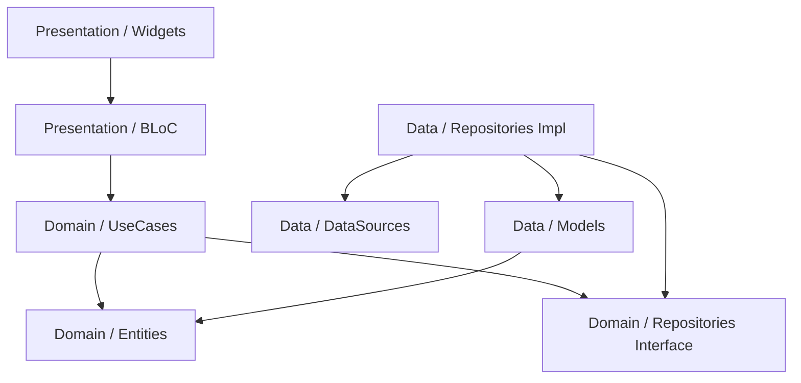

# EchoNews 🚀

[](https://flutter.dev/)
[](https://blog.cleancoder.com/uncle-bob/2012/08/13/the-clean-architecture.html)
[](https://opensource.org/licenses/MIT)

EchoNews is a high-performance, minimalist Hacker News client built with Flutter. It prioritizes clean code, scalability, and a premium user experience while staying true to the iconic Hacker News aesthetic.

---

## 🎨 Design Philosophy
EchoNews is designed to be **minimalist yet modern**. 
- **Typography**: Uses the *Inter* font family for maximum readability.
- **Color Palette**: Strictly adheres to the classic Hacker News orange (`#FF6600`) for the header and a light cream (`#F6F6EF`) for the background.
- **Interactions**: Smooth transitions and concurrent data loading for a "snappy" feel.

## ✨ Features
- **Top Stories Feed**: Browse the latest top 30 stories with real-time score and comment counts.
- **Deep Threading**: View story details and first-level comments with semantic HTML rendering.
- **Concurrent Loading**: API calls are parallelized using `Future.wait` to eliminate serial waiting.
- **Robust Error Handling**: Implements a functional approach (Either type) for failure management.
- **Url Launcher**: Open story links directly in the browser with a single tap.

## 🏗️ Architecture
The project follows **Uncle Bob's Clean Architecture**, ensuring a complete separation of concerns between the UI, business logic, and data sources.

### Layer Breakdown:
- **Presentation Layer**: Uses the **BLoC** pattern for predictable state management.
- **Domain Layer**: The heart of the app, containing **Entities**, **UseCases**, and **Repository Interfaces**.
- **Data Layer**: Implements the repositories and handles **JSON serialization** and **Network communication**.

### Dependency Graph (Simplified):


## 🛠️ Tech Stack
| Category | Technology |
| :--- | :--- |
| **Language** | Dart |
| **Framework** | Flutter |
| **State Management** | flutter_bloc |
| **Service Locator** | get_it |
| **Functional Programming** | dartz |
| **Networking** | http |
| **UI Components** | flutter_html, google_fonts |

## 🚀 Getting Started

### Prerequisites
- Flutter SDK (v3.x.x)
- Android Studio / VS Code
- An Android/iOS Emulator or Physical Device

### Installation
1. Clone the repository:
   ```bash
   git clone https://github.com/Prashantj44/echo_news.git
   ```
2. Navigate to the project directory:
   ```bash
   cd echo_news
   ```
3. Install dependencies:
   ```bash
   flutter pub get
   ```
4. Run the application:
   ```bash
   flutter run
   ```

---

## 📸 Screenshots
| Home Screen | Detail Screen |
| :---: | :---: |
|  | *Coming Soon* |

---

Developed with ❤️ by Prashant.
