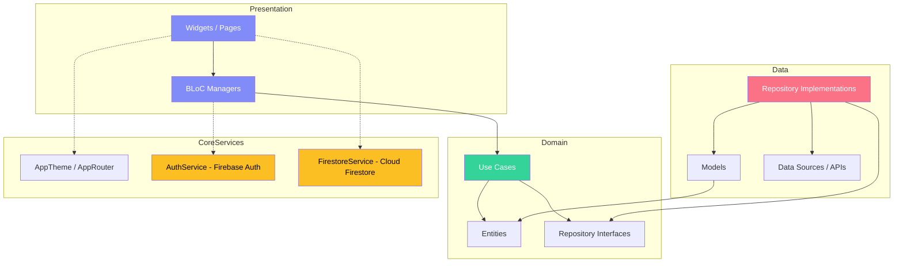

# EchoNews 🚀

[](https://flutter.dev/)
[](https://blog.cleancoder.com/uncle-bob/2012/08/13/the-clean-architecture.html)
[](https://firebase.google.com/)
[](https://bloclibrary.dev/)
[](https://opensource.org/licenses/MIT)

**EchoNews** is a high-performance, premium global news reader app built with Flutter. It has been transformed from a basic prototype into a professionally architected news application featuring a centralized Material 3 design system, state-of-the-art glass-morphism login/signup visual effects, robust state management using BLoC, real-time Firebase Authentication (Email/Password & Google Sign-In), and persistent Cloud Firestore integration.

---

## 🎨 Premium Visual Overhaul & Aesthetics

EchoNews has been customized with rich aesthetics, smooth animations, and premium styling cues:
* **Glass-morphism UI**: Uses background blur filter layers (`BackdropFilter`) and frosted cards over dark, deep gradient backgrounds for modern login/signup screens.
* **Micro-Animations**: Features floating decorative gradients, scaling logo animations, and smooth fade-in staggered page transitions.
* **Shimmer Skeleton Loading**: Custom-designed, premium shimmer effect widgets that dynamically animate while content fetches, replacing basic loaders.
* **Unified Theme Scale**: Fully-typed typography scale using *Outfit* and *Inter* fonts, alongside a semantic color palette mapping 80+ Material 3 tokens.

---

## ✨ Features

- **Top Stories Feed**: Browse the latest top 30 stories with real-time score indicators, author info, and comment counts.
- **AI-Enhanced News Feed**: Categorize, summarize, and customize your feed preferences.
- **Glass-morphism Authentication**:
  - **Email & Password**: Secure accounts with live verification and match confirmation.
  - **Google Sign-In**: Quick, authenticated access with Google accounts.
  - **Password Reset**: Send password recovery emails straight from the UI.
- **Session Persistence**: Splash screen automatically detects active Firebase Auth state and routes accordingly.
- **Cloud Firestore Integration**:
  - **User Preferences**: Save feed topics, preferred languages, and regional options directly to the cloud.
  - **Live Bookmarks**: Cross-device syncing for bookmarking and removing stories in real-time.
- **Deep Threading**: Render story details and comment levels cleanly with semantic HTML parsing and custom styling.

---

## 🏗️ Architecture

The codebase adheres strictly to **Clean Architecture** patterns combined with **BLoC (Business Logic Component)** state management:

```
lib/
├── core/
│   ├── config/       # Local preference storage
│   ├── router/       # Named routing & custom transitions (AppRouter)
│   ├── services/     # Firebase Authentication & Firestore wrappers
│   └── theme/        # AppColors, AppTextStyles, and Material 3 AppTheme
├── features/
│   ├── auth/         # Login, Registration, Splash page & BLoC state
│   ├── detail/       # Global News story details & comments UI
│   └── home/         # Onboarding, top stories feed, & widgets
└── injection_container.dart # Service locator (GetIt) dependency setup
```

### Clean Architecture Dependency Graph



---

## 🛠️ Tech Stack

| Category | Technology |
| :--- | :--- |
| **Language** | Dart / Kotlin |
| **Framework** | Flutter SDK (3.x) |
| **Backend Services** | Firebase Auth, Cloud Firestore |
| **State Management** | flutter_bloc (BLoC Pattern) |
| **Dependency Injection**| get_it (Service Locator) |
| **Functional helpers**| dartz |
| **Networking & APIs**| http, Google News RSS, Gemini AI |
| **Package Management**| Flutter Pub |

---

## 🚀 Getting Started

### Prerequisites
* Flutter SDK (3.x.x)
* Android SDK (minimum API level 23)
* Firebase CLI installed (`npm install -g firebase-tools`)
* FlutterFire CLI installed (`dart pub global activate flutterfire_cli`)

### Installation & Run

1. **Clone the repository**:
   ```bash
   git clone https://github.com/Prashantj44/echo_news.git
   cd echo_news
   ```

2. **Install Flutter packages**:
   ```bash
   flutter pub get
   ```

3. **Firebase Setup**:
   Log in to your Firebase account and configure the project:
   ```bash
   firebase login
   flutterfire configure --project=echo-news-prashant
   ```
   *Note: Select Android, iOS, and Web platforms to generate necessary configurations.*

4. **Verify / Run the Application**:
   Build the debug APK or run it on an emulator:
   ```bash
   # Run on connected device
   flutter run
   
   # Build the debug APK
   flutter build apk --debug
   ```

---

## 🔒 Firebase Console Configurations (Required)

To ensure all backend-dependent features function properly:
1. **Enable Authentication Providers**:
   * Navigate to **Firebase Console** -> **Authentication** -> **Sign-in method**.
   * Enable **Email/Password**.
   * Enable **Google**.
2. **Add SHA-1 Signature**:
   * Run the Gradle signing report to get your SHA-1 fingerprint:
     ```bash
     cd android && ./gradlew signingReport
     ```
   * Register the SHA-1 fingerprint under your Android App settings in the Firebase Console to enable Google Sign-In.
3. **Firestore Database**:
   * Enable Cloud Firestore in **Production Mode** or **Test Mode** with standard read/write security rules.

---

Developed with ❤️ by Prashant.
